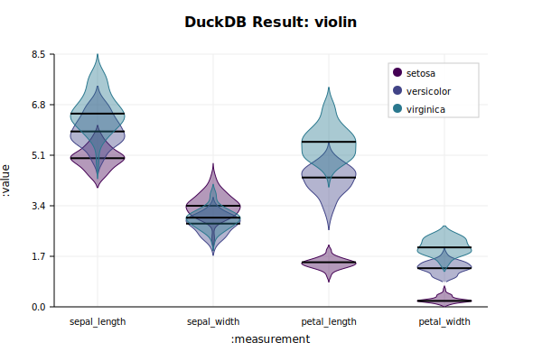

# emacs-duckdb

An Emacs dynamic module for DuckDB.

## Features
- **Performance:** Columnar C API for fast data processing.
- **Stability:** Zero memory leaks with `user_ptr` finalizers.
- **Ergonomics:** Native Elisp API, `with-duckdb` macros, and interactive browser.
- **Asynchronous:** Support for non-blocking queries with callbacks.
- **Interactive:** Built-in table browser with data preview.

---

## Installation

### Prerequisites
- **DuckDB:** Ensure you have the DuckDB shared library installed.
  - **macOS:** `brew install duckdb`
  - **Linux:** Install via your package manager or download from [duckdb.org](https://duckdb.org/install/?platform=linux&environment=c).
- **Emacs:** Emacs 28 or newer with dynamic module support.

### Installation Methods

Duckdb-el can be installed using various Emacs package managers:

#### straight.el

```elisp
(use-package duckdb
  :straight (duckdb :type git :host github :repo "ricardog/duckdb-el"
		    :files (:defaults "*.el" "*.c" "*.h" "iris.csv"
				      "CMakeLists.txt"))
)
```

#### Quelpa

```elisp
(use-package duckdb
  :quelpa (duckdb :fetcher github :repo "ricardog/duckdb-el")
)
```

#### elpaca

```elisp
(use-package duckdb
  :elpaca (duckdb :host github :repo "ricardog/duckdb-el")
)
```

#### Manual Installation

Clone the repository and add it to your `load-path`:

```bash
git clone https://github.com/ricardog/duckdb-el.git ~/.emacs.d/duckdb-el
```

```elisp
(add-to-list 'load-path "~/.emacs.d/duckdb-el")
(require 'duckdb)
```

### Building
Clone the repository and run `cmake`:

```bash
mkdir build && cd build
cmake ..
make
```

This will produce `duckdb-core.so` in the `build/` directory.

---

## Usage

### Basic Example
```elisp
;; Ensure duckdb-core.so and duckdb.el are in your load-path
(add-to-list 'load-path "/path/to/emacs-duckdb/build")
(add-to-list 'load-path "/path/to/emacs-duckdb")
(require 'duckdb)

;; Simple query
(with-duckdb conn ":memory:"
  (duckdb-execute conn "CREATE TABLE test (id INTEGER, name VARCHAR);")
  (duckdb-execute conn "INSERT INTO test VALUES (1, 'Alice'), (2, 'Bob');")
  (duckdb-select conn "SELECT * FROM test;"))
;; => ((1 "Alice") (2 "Bob"))
```

### Parameterized Queries
Safely bind values to your SQL queries:
```elisp
(with-duckdb conn ":memory:"
  (duckdb-execute conn "INSERT INTO users (name, age) VALUES (?, ?);" '("Alice" 30)))
```

### Columnar Results
For large datasets, use `duckdb-select-columns` to get results in a high-performance columnar format (vectors):
```elisp
(let* ((results (duckdb-select-columns conn "SELECT * FROM large_table;"))
       (data (plist-get results :data))
       (types (plist-get results :types)))
  (message "Column names: %s" (cl-loop for (k v) on data by 'cddr collect k))
  (aref (plist-get data :some_column) 0)) ;; Access first row of 'some_column'
```

### Asynchronous Queries
Run long-running queries without freezing Emacs:
```elisp
(duckdb-select-async conn "SELECT count(*) FROM big_data;"
                     (lambda (status results)
                       (if (plist-get status :error)
                           (message "Query failed: %s" (cdr (plist-get status :error)))
                         (message "Query finished! Count: %s" (caar results)))))
```

### Interactive Browser
Open and browse a DuckDB database file interactively:
- `M-x duckdb-mode-open-file`: Select a database file to browse its tables.
- In the browse buffer:
  - `RET`: Toggle data preview for the table at point.
  - `Q`: will pop-up a SQL buffer were you can type a query to run
    against the DB.  By default will only fetch 100 rows.
  - `g`: Refresh the table list.
- In the results buffer:
  - `e`: Edit the query.
  - `m`: Fetch more data.

### Drake Integration
[drake](https://github.com/ricardog/drake) is an interactive plotting
library that can be used with duckdb data. When paired together they
provide a powerful data exploration environment within Emacs.

`drake` defines a Transient UI to plot the results of a `duckdb`
interactive query (`drake-duckdb-transient`).  Bind this in the
`duckdb-query-results-mode-map` for easy access in the **results**
buffer (see the `drake` README for details).  The transient allows easy
selection the chart attributes.

Sample chart generated by `drake` using the transient.



Transforming the `iris` dataset from "wide" format to "tall" format for
use in the chart is easy with **DuckDB**.

```sql
UNPIVOT iris
ON sepal_length, sepal_width, petal_length, petal_width
INTO
    NAME measurement
    VALUE value
```

---

## Org-babel Support
`emacs-duckdb` includes high-performance Org-babel support via `ob-duckdb.el`.

### Setup
```elisp
(require 'ob-duckdb)
```

### Basic Example
Execute SQL directly in your Org files:
```org
#+begin_src duckdb :db ":memory:" :colnames yes
SELECT 1 as id, 'Alice' as name
UNION ALL
SELECT 2, 'Bob'
#+end_src

#+RESULTS:
| id | name  |
|----+-------|
|  1 | Alice |
|  2 | Bob   |
```

### Sessions
Use `:session` to persist tables and views across different source blocks:
```org
#+begin_src duckdb :session my-db
CREATE TABLE users (id INTEGER, name TEXT);
INSERT INTO users VALUES (1, 'Alice'), (2, 'Bob');
#+end_src

#+begin_src duckdb :session my-db
SELECT * FROM users WHERE id = 1;
#+end_src
```

### Variable Binding
Bind Org-mode tables or simple values to DuckDB views:
```org
#+NAME: raw_data
| id | score |
|----+-------|
|  1 |    85 |
|  2 |    92 |

#+begin_src duckdb :var data=raw_data :var threshold=90
SELECT * FROM data WHERE score >= threshold;
#+end_src

#+RESULTS:
| id | score |
|----+-------|
|  2 |    92 |
```
Variable binding for tables uses DuckDB's high-speed `read_csv_auto` under the hood for maximum performance.

## Development
Run tests with:
```bash
cd build && ctest
```
To run tests with Address Sanitizer:
```bash
cmake .. -DENABLE_ASAN=ON
make
ctest
```

---

## License
GPL compatible.
